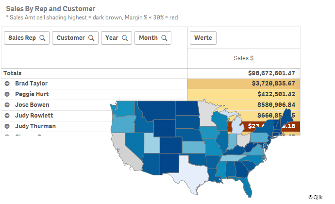
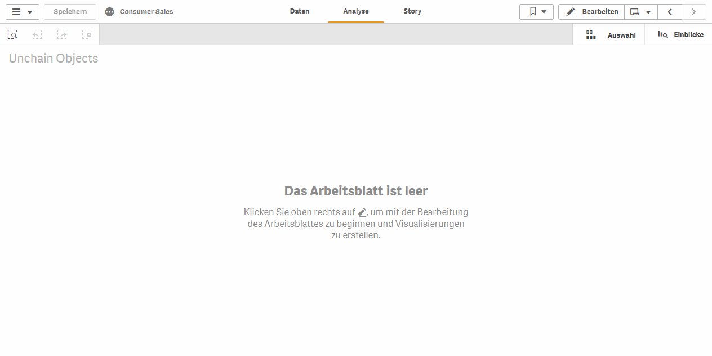

# Unchain QlikSense Objects

## Introduction

Developing nice Qlik Sense visualization applications is quite limited. Qlik Sense itself offers the user limited options to align objects inside a given sheet. Mostly those objects can only be aligned next to or above each other. Depending on the UI you are building, this can be quite a difficult task.

Simple objects like text-boxes, logos or buttons need to have their dedicated space, where most likely they can share the space with other objects.

* Ever wanted your Qlik Sense Extensions to take up no space at all?
* Using you [favorite sheet events trigger](https://github.com/LizardisGmbH/SheetEvents) while not displaying it in the UI?
* Changing variables, using button/ input extensions, for a specific chart and not hassle over the used space?
* Displaying a logo inside a textbox with text?

Introducing "Unchain QlikSense Objects" , an experimental Qlik Sense Extension to show the capabilities of the Qlik-Engine-API.

This extensions allows Qlik Sense objects to be overlapped.

To do so, an object will be re-positioned in its sheet with absolute positions of `x = 0` and `y = 0`.

## How-to

1. Add your objects to the UI

2. Add the Extension to the UI

   > Located under Extensions > Lizardis Extensions > Unchain QlikSense Objects

3. Make sure you have the Qlik development tools activated

   > Append `/options/developer` into your URL

4. Retrieve the Object-ID of one object which's positions should be repositioned

5. Enter this ID into the `config` part of the extension and hit `Enter`

6. Make sure the correct Object-ID is shown in the button label

7. Click the button

8. Optional: Delete the extension. The positioning is stored in the sheet properties

## Notes

Even though the configuration of positioning any objects inside a sheet has not changed for quite a long time, and can thus be considered as "stable", this extension is mainly developed as a proof-of-concept. Future updates of Qlik Sense can change the way objects are placed on sheets.

We will keep track of future Qlik Sense updates and further develop this extension if necessary.

Use it on your own risk for enterprise or production environments.

> Additionally: This extension only re-writes the behavior of objects in "desktop" resolutions. Mobile resolutions and mashups are not affected!

## Roadmap

1. Re-Order objects by moving the layer up and down
2. Include safe-fails